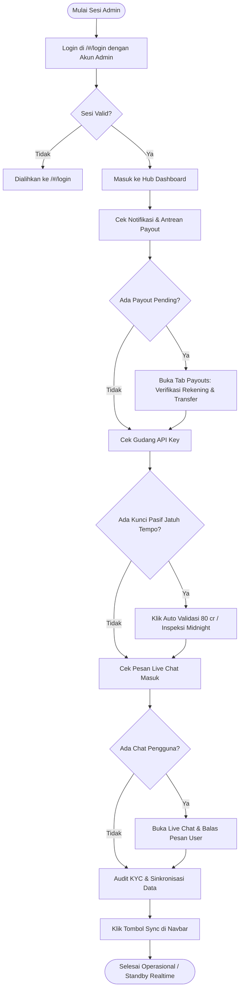
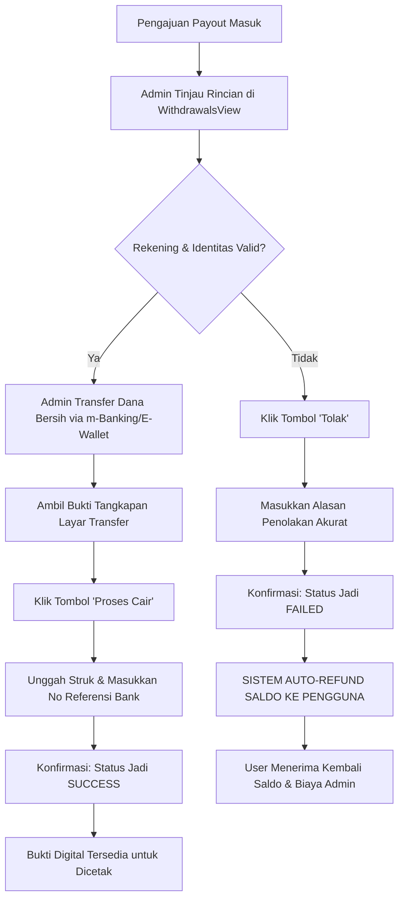

# 📘 Panduan Alur Kerja & Flow Penggunaan Admin
## Executive Control Center — Panen Kunci (v1.2.0)

Dokumen ini merupakan panduan operasional resmi bagi **Administrator** platform **Panen Kunci**. Panduan ini mencakup seluruh alur kerja (*standard operating procedure / SOP*), arsitektur navigasi, verifikasi stok API Key, approval pencairan dana (*payout*), audit pengguna & KYC, konfigurasi sistem tarif, hingga layanan *Live Chat*.

---

## 📑 Daftar Isi
1. [Ikhtisar & Akses Role Administrator](#1-ikhtisar--akses-role-administrator)
2. [Arsitektur Antarmuka & Navigasi Hub](#2-arsitektur-antarmuka--navigasi-hub)
3. [Flow 1: Verifikasi & Manajemen Gudang API Key](#3-flow-1-verifikasi--manajemen-gudang-api-key)
4. [Flow 2: Persetujuan Pencairan Dana (Payouts)](#4-flow-2-persetujuan-pencairan-dana-payouts)
5. [Flow 3: Manajemen Pengguna & Verifikasi KYC](#5-flow-3-manajemen-pengguna--verifikasi-kyc)
6. [Flow 4: Konfigurasi Tarif, Komisi & Holding Saldo](#6-flow-4-konfigurasi-tarif-komisi--holding-saldo)
7. [Flow 5: Layanan Pusat Bantuan (Live Chat Admin)](#7-flow-5-layanan-pusat-bantuan-live-chat-admin)
8. [Diagram Alur Operasional (Mermaid Flowcharts)](#8-diagram-alur-operasional-mermaid-flowcharts)
9. [Standar Operasional Prosedur (SOP) Harian Admin](#9-standar-operasional-prosedur-sop-harian-admin)
10. [Panduan Pemecahan Masalah (Troubleshooting)](#10-panduan-pemecahan-masalah-troubleshooting)

---

## 1. Ikhtisar & Akses Role Administrator

Sistem Panen Kunci membedakan hak akses secara ketat antara **Pengguna Reguler (User)** dan **Administrator (Admin)**. Panel admin berjalan pada rute mandiri `/admin_panel/index.html` dengan perlindungan sesi lapis ganda.

### 1.1 Kredensial & Autentikasi Admin
Admin dapat masuk (*login*) melalui halaman otentikasi utama `/#/login`:
* **Email Resmi Admin**: `admin@panenkunci.id` atau `admin@panenkunci.com`
* **Role Supabase**: Pengguna yang pada tabel `users` memiliki atribut `role = 'admin'`.

### 1.2 Mekanisme Session Guard & Proteksi Rute
1. **Penyimpanan Sesi**: Saat autentikasi sukses, sistem menyuntikkan flag keamanan:
   * `panenkunci:admin_logged_in = 'true'`
   * `panenkunci:auth_role = 'admin'`
2. **Pengalihan Otomatis (Redirect)**:
   * Jika akun terverifikasi sebagai admin, aplikasi langsung mengarahkan layar ke `/admin_panel/index.html`.
   * Di antarmuka pengguna biasa, tombol pintasan **"Panel Admin"** otomatis muncul di bilah navigasi atas (*Header*) dan halaman Profil pengguna.
   * Akses URL hash seperti `/#/admin` atau `/#/admin_panel` di aplikasi client akan dicegat oleh router internal dan dialihkan ke `/admin_panel/index.html`.
3. **Pencegahan Akses Ilegal (Session Guard & BFCache)**:
   * Berkas `admin-main.js` secara otomatis memvalidasi flag sesi saat pertama kali dimuat. Jika flag tidak ada atau tidak bernilai `admin`, akses ditolak dan browser dialihkan paksa ke `/#/login`.
   * Dilengkapi listener event `pageshow` untuk mencegah pengguna kembali membuka panel admin setelah *logout* melalui riwayat cache peramban (*Back-Forward Cache / bfcache*).
4. **Alur Keluar Sesi (Logout)**:
   * Tombol **"Keluar"** di navbar atas membersihkan seluruh sesi lokal (`localStorage`, `sessionStorage`), menjalankan pemutusan sesi di Supabase Auth (`supabase.auth.signOut()`), dan mengarahkan admin kembali ke `/#/login`.

---

## 2. Arsitektur Antarmuka & Navigasi Hub

Panel Admin Panen Kunci dirancang dengan filosofi **Modern App Hub Dashboard**, menghadirkan pengalaman visual kelas eksekutif yang responsif di Desktop maupun Mobile PWA.

### 2.1 Komponen Bilah Atas (Sticky Top Navbar)
Navbar tetap berada di bagian atas layar (*sticky*) dan memuat kontrol global:
* **Logo & Brand**: Identitas resmi Panen Kunci. Mengklik logo akan membawa admin kembali ke halaman muka Dashboard (`#dashboard`).
* **Breadcrumb & Tombol Kembali**: Saat berada di sub-halaman (Gudang API Key, Payout, Pengguna, atau Pengaturan), tombol panah kembali (`arrow_back`) dan indikator halaman aktif memudahkan navigasi kilat.
* **Tombol Live Chat**: Ikon forum dengan *badge* angka dinamis yang berkedip jika terdapat pesan obrolan baru dari pengguna.
* **Tombol Sinkronisasi (Sync)**: Ikon sinkronisasi dengan animasi rotasi untuk menarik pembaruan data real-time dari Supabase (Pengguna, API Key, Transaksi, dan Konfigurasi).
* **Toggle Mode Gelap/Terang (Theme Toggle)**: Beralih instan antara mode Malam (*Dark Mode*) dan mode Siang (*Light Mode*) tanpa lag dan menjaga kontras data.
* **Tombol Logout**: Keluar dari sesi administrasi secara aman.

### 2.2 Beranda Hub (HubDashboardView)
Beranda utama menyajikan 4 kartu modul operasional utama (*interactive squircle card grid*):
1. **Persetujuan Payout (`#withdrawals`)**: Menampilkan jumlah antrean penarikan pending dan total dana yang siap dicairkan.
2. **Gudang API Key (`#apikeys`)**: Menampilkan total stok kunci, status kunci pasif dalam masa holding, dan kunci aktif valid.
3. **Kelola Pengguna (`#users`)**: Menampilkan jumlah akun terdaftar, status verifikasi identitas (KYC), dan total saldo beredar.
4. **Pengaturan Tarif (`#settings`)**: Pusat pengaturan harga beli per kunci, minimum payout, komisi referral, dan masa holding saldo.

---

## 3. Flow 1: Verifikasi & Manajemen Gudang API Key

Modul ini bertanggung jawab atas siklus hidup seluruh API Key yang disetor oleh pengguna ke dalam ekosistem Panen Kunci.

```
+-----------------------------------------------------------------------------------+
|                        SIKLUS HIDUP API KEY (KEY LIFECYCLE)                       |
+-----------------------------------------------------------------------------------+
|                                                                                   |
|  [ User Setor Kunci ]                                                             |
|           |                                                                       |
|           v                                                                       |
|    +--------------+    Kredit < 80 cr / Format Salah    +---------------+         |
|    | Status:      | ----------------------------------> | Status:       |         |
|    | PENDING      |                                     | INVALID       |         |
|    | (Kunci Pasif)|                                     | (Ditolak)     |         |
|    +--------------+                                     +---------------+         |
|           |                                                     |                 |
|           | Masa Pantau Holding Selesai                         v                 |
|           | & Kredit Tetap 80 cr                        Saldo Pasif Batal         |
|           v                                                                       |
|    +--------------+                                                               |
|    | Status:      |                                                               |
|    | VALID        | ===> Saldo Pasif Cair Jadi Saldo Aktif User                   |
|    | (Kunci Aktif)|                                                               |
|    +--------------+                                                               |
|           |                                                                       |
|           | Dialokasikan / Dijual ke Partner                                      |
|           v                                                                       |
|    +--------------+                                                               |
|    | Status:      |                                                               |
|    | USED         |                                                               |
|    | (Terpakai)   |                                                               |
|    +--------------+                                                               |
+-----------------------------------------------------------------------------------+
```

### 3.1 Status API Key & Penjelasannya
| Status | Label UI | Definisi & Dampak Finansial |
| :--- | :--- | :--- |
| `pending` | **Kunci Pasif** | Kunci baru disetor. Pengguna menerima **Saldo Pasif**. Kunci sedang dalam masa observasi holding agar kredit tidak langsung dihabiskan oleh penyetor. |
| `valid` | **Kunci Aktif** | Kunci telah lolos verifikasi dan memiliki kredit penuh (80 cr). Saldo pasif pengguna otomatis dikonversi menjadi **Saldo Aktif** yang siap ditarik. |
| `used` | **Used** | Kunci telah dialokasikan, dijual ke pembeli/developer pihak ketiga, atau digunakan untuk kebutuhan operasional backend. |
| `invalid` | **Invalid** | Kunci tidak valid, API Key revoked, atau kredit telah berkurang sebelum masa holding berakhir. Saldo pasif pengguna ditarik/dibatalkan. |

### 3.2 Masa Tunggu Holding (Holding Period) & Percepatan Referral
* Untuk mencegah penipuan di mana penyetor mengambil saldo lalu menghabiskan kredit kunci sebelum dijual, sistem menerapkan **Masa Pantau Holding**:
  * **Standar (Tanpa Referral)**: Default 3 Hari (atau disesuaikan di Pengaturan dalam menit/jam/hari).
  * **Dengan Kode Referral**: Default 2 Hari (durasi lebih singkat sebagai insentif bagi pengguna jaringan referral).
* Indikator status di tabel menampilkan sisa hitung mundur secara langsung:
  * `⏳ Sisa 2h 4j` : Masih dalam masa observasi holding.
  * `⚡ Siap Validasi` : Masa holding telah terpenuhi dan kunci siap disahkan.

### 3.3 Prosedur Operasional Admin pada Gudang API Key
1. **Penyaringan Kunci (Filtering & Search)**:
   * Gunakan tombol filter cepat: **Semua**, **Kunci Aktif**, atau **Kunci Pasif**.
   * Gunakan kolom pencarian untuk melacak berdasarkan potongan string key, ID Pengguna, email, atau nama pemilik.
2. **Validasi Otomatis (Auto-Validate)**:
   * Klik tombol **"Auto Validasi (80 cr)"** di baris atas untuk memproses semua kunci berstatus pending secara massal. Sistem akan memeriksa kelayakan kredit dan langsung mengubah kunci yang memenuhi syarat menjadi `valid`.
   * Tombol **"Auto"** pada baris tabel dapat diklik untuk mengeksekusi validasi instan pada satu kunci tertentu.
3. **Inspeksi Jam 00:00 WIB (Midnight Kie Inspection)**:
   * Tombol **"Inspeksi 00:00 WIB"** menjalankan fungsi audit komprehensif ke server Kie.ai:
     * Menolak kunci pending yang kreditnya berkurang (< 80 cr).
     * Mensahkan kunci pending yang telah melewati masa holding dan kreditnya utuh.
4. **Pemeriksaan Kredit Satuan & Massal**:
   * Klik **"Sinkron Kie.ai"** untuk menyelaraskan sisa kredit seluruh kunci langsung dari server Kie.ai.
   * Klik ikon sinkronisasi kecil di samping nominal kredit (`80 cr`) pada baris tertentu untuk menyegarkan kredit 1 kunci saja.
5. **Menandai Kunci Terpakai (`set-status: used`)**:
   * Setelah admin mengekspor atau mendistribusikan kunci valid ke pembeli, klik tombol **"Used"** pada baris kunci tersebut agar stok tidak tertukar atau terpakai ganda.
6. **Penolakan & Penghapusan Kunci**:
   * Klik tombol silang (**Tolak**) untuk membatalkan kunci pending yang tidak valid. Saldo pasif pengguna akan otomatis ditarik kembali.
   * Klik ikon tempat sampah (**Hapus**) untuk membersihkan baris kunci dari basis data secara permanen.

---

## 4. Flow 2: Persetujuan Pencairan Dana (Payouts)

Modul Persetujuan Payout adalah inti dari keamanan finansial platform. Modul ini memastikan dana hanya ditransfer ke rekening yang terverifikasi dan setiap transaksi memiliki bukti digital yang sah.

```
+-----------------------------------------------------------------------------------+
|                     FLOW PERSETUJUAN PENCAIRAN DANA (PAYOUT)                      |
+-----------------------------------------------------------------------------------+
|                                                                                   |
|  [ User Ajukan Tarik Saldo ]                                                      |
|           |                                                                       |
|           v                                                                       |
|  [ Notifikasi Realtime Masuk ke Panel Admin ]                                     |
|           |                                                                       |
|           v                                                                       |
|  [ Admin Membuka Tab Payouts (#withdrawals) ]                                     |
|           |                                                                       |
|           +---> Klik Baris untuk Membuka Detail Transaksi                         |
|           |                                                                       |
|           v                                                                       |
|  [ Evaluasi Data Pengajuan ]                                                      |
|  - Cek Nama Pengguna & Status KYC                                                 |
|  - Cek Bank / E-Wallet Tujuan & Nomor Akun                                        |
|  - Cek Rincian: Nominal - Fee Admin - Komisi Referral = Transfer Bersih           |
|           |                                                                       |
|           +---------------------------------------+                               |
|           |                                       |                               |
|     (DATA VALID)                            (DATA TIDAK VALID)                    |
|           |                                       |                               |
|           v                                       v                               |
|  [ Transfer via m-Banking/E-Wallet ]       [ Klik Tombol "Tolak" ]                |
|  - Kirim sesuai nilai Transfer Bersih             |                               |
|  - Simpan tangkapan layar bukti transfer          v                               |
|           |                                [ Modal Penolakan Terbuka ]            |
|           v                                - Pilih/Tulis Alasan Penolakan         |
|  [ Klik Tombol "Proses Cair" ]             - Konfirmasi                           |
|           |                                       |                               |
|           v                                       v                               |
|  [ Modal Approval Terbuka ]                [ Status: FAILED ]                     |
|  - Input Nomor Referensi Transfer          [ SISTEM AUTO-REFUND SALDO KE USER ]   |
|  - Unggah Foto Bukti Transfer m-Banking                                           |
|  - Konfirmasi Selesai                                                             |
|           |                                                                       |
|           v                                                                       |
|  [ Status: SUCCESS / COMPLETED ]                                                  |
|  [ Bukti Transfer Tersimpan & Dapat Dicetak ]                                     |
+-----------------------------------------------------------------------------------+
```

### 4.1 Struktur Biaya & Kalkulasi Payout
Setiap pengajuan penarikan dana menghitung komponen biaya secara transparan:
1. **Nominal Pengajuan Kotor**: Jumlah saldo aktif yang ditarik oleh user (misal: Rp 100.000).
2. **Biaya Admin (Fee)**: Dipotong untuk biaya jaringan perbankan / e-wallet (misal: Rp 1.000 untuk DANA/GoPay/OVO, Rp 2.500 untuk Bank Transfer).
3. **Potongan Komisi Referral**: Jika pengguna mendaftar dengan kode referral, persentase komisi (misal 5% = Rp 5.000) dialokasikan sebagai bonus bagi pemilik kode referral.
4. **Nilai Transfer Bersih (Net Payout)**:
   $$\text{Transfer Bersih} = \text{Nominal Kotor} - \text{Biaya Admin} - \text{Potongan Referral}$$
   *Nilai inilah yang wajib ditransfer oleh admin ke rekening tujuan pengguna.*

### 4.2 Prosedur Menyetujui Payout (Approval Flow)
1. Buka tab **Persetujuan Payout** (`#withdrawals`).
2. Temukan permohonan berstatus kuning (**Pending**).
3. Klik pada baris permohonan untuk membuka akordeon rincian transaksi:
   * Periksa kesesuaian **Nama Akun**, **Metode Tujuan** (misal BCA / DANA), dan **Nomor Rekening/HP**.
   * Perhatikan nilai **Transfer Bersih**.
4. Buka aplikasi perbankan atau e-wallet korporat/admin, lalu lakukan transfer dana sesuai nominal **Transfer Bersih** ke nomor rekening pengguna.
5. Simpan tangkapan layar (*screenshot*) bukti transfer yang memuat nomor referensi bank.
6. Pada panel admin, klik tombol **"Proses Cair"**.
7. Pada jendela modal yang muncul:
   * Masukkan **Nomor Referensi Transfer** (misal: `TRX-BCA-88392019`).
   * Unggah berkas gambar struk transfer m-Banking.
   * Tambahkan catatan operasional bila diperlukan.
8. Klik **"Konfirmasi & Selesaikan Payout"**.
9. Status transaksi seketika berubah menjadi hijau (**Telah Ditransfer / Success**), notifikasi terkirim, dan bukti digital diarsipkan.

### 4.3 Prosedur Menolak Payout (Rejection with Auto-Refund Flow)
Jika nomor rekening tidak ditemukan, nama akun tidak cocok, akun bank terblokir, atau terindikasi kecurangan:
1. Buka rincian pengajuan yang bersangkutan, lalu klik tombol merah **"Tolak"**.
2. Pada modal konfirmasi penolakan, masukkan **Alasan Penolakan** yang jelas dan edukatif (contoh: *"Nomor akun DANA 0812xxxx belum terdaftar / akun belum di-upgrade ke premium"*).
3. Klik tombol **"Konfirmasi Tolak & Refund Saldo"**.
4. **Mekanisme Otomatis Sistem**:
   * Status transaksi berubah menjadi merah (**Ditolak / Failed**).
   * Catatan penolakan tersimpan di riwayat transaksi pengguna.
   * **Sistem secara otomatis mengembalikan (refund) seluruh saldo yang ditarik beserta biaya admin kembali ke dompet pengguna**. Admin tidak perlu melakukan penyesuaian saldo manual.

### 4.4 Bukti Digital Transfer (Digital Receipt)
* Setiap transaksi (baik pending, sukses, maupun gagal) memiliki bukti transaksi digital.
* Klik tombol **"Lihat Bukti Digital"** di baris mana saja untuk membuka modal struk:
  * Memuat stempel resmi (*PAID / COMPLETED*).
  * Menampilkan barcode referensi, timestamp pemrosesan, dan detail rekening tujuan.
  * Menampilkan foto struk transfer m-Banking yang diunggah.
  * Dilengkapi tombol **"Cetak Struk"** untuk mencetak struk fisik atau menyimpannya sebagai format dokumen PDF.

---

## 5. Flow 3: Manajemen Pengguna & Verifikasi KYC

Modul Pengguna memberikan kendali penuh terhadap basis data member, validasi identitas (*Know Your Customer / KYC*), serta audit kepemilikan saldo.

### 5.1 Indikator Visual & Struktur Akun
Daftar pengguna disajikan dalam format kartu akordeon interaktif dengan aksen semantik:
* **Garis Batas Hijau (`border-l-4 border-emerald-500`)**: Menandakan akun telah berstatus **KYC Terverifikasi**.
* **Garis Batas Abu-abu/Amber**: Menandakan akun masih berstatus **Belum KYC**.
* **Informasi Cepat**: Menampilkan nama lengkap, alamat email/User ID, total setoran kunci valid, saldo aktif beredar, dan tanggal pendaftaran.

### 5.2 Verifikasi Status KYC (1-Klik)
1. Buka tab **Kelola Pengguna** (`#users`).
2. Buka detail pengguna dengan mengklik baris pengguna yang diinginkan.
3. Pada tombol status verifikasi:
   * Klik tombol **"Verifikasi KYC"** untuk mengesahkan identitas pengguna.
   * Klik tombol **"Cabut KYC"** jika pengguna memerlukan validasi ulang atau terdeteksi pelanggaran.
4. Perubahan status KYC tersimpan seketika dan tersinkronisasi langsung ke database Supabase.

### 5.3 Penyesuaian Saldo Pengguna (Adjust Balance Modal)
Fitur ini digunakan untuk memberikan kompensasi, reward promo/event, atau koreksi saldo manual secara aman:
1. Klik tombol **"Atur Saldo"** pada baris pengguna yang dituju.
2. Modal khusus interaktif akan terbuka (tanpa menggunakan dialog bawaan browser yang rentan error).
3. Pilih mode aksi:
   * **Tambah Saldo (+)**: Untuk bonus promo, reward giveaway, atau penambahan manual.
   * **Kurangi Saldo (-)**: Untuk koreksi overpay atau penalti.
   * **Set Saldo Tetap (=)**: Mengatur saldo akun secara absolut.
4. Masukkan nominal rupiah dan **Alasan Penyesuaian** untuk jejak audit.
5. Klik **"Simpan Penyesuaian Saldo"**. Sistem akan memperbarui saldo pengguna dan mencatat riwayat transaksi internal.

### 5.4 Audit Riwayat Pengguna (User Details Modal)
1. Klik tombol **"Lihat Riwayat"** di baris pengguna.
2. Modal audit komprehensif akan menampilkan:
   * Rincian akun, tanggal bergabung, status login terakhir, dan ID pengguna Supabase.
   * Daftar seluruh API Key yang pernah disetorkan oleh pengguna tersebut beserta status validitasnya.
   * Riwayat seluruh pengajuan penarikan dana beserta nomor rekening tujuannya.

---

## 6. Flow 4: Konfigurasi Tarif, Komisi & Holding Saldo

Modul Pengaturan (`#settings`) memungkinkan administrator mengubah parameter ekonomi platform tanpa perlu mengubah kode sumber (*zero code deployment*).

### 6.1 Parameter Konfigurasi
1. **Reward per API Key Valid (Rp)**:
   * Nominal rupiah yang diperoleh penyetor saat 1 API Key divalidasi (Default: `Rp 3.000`).
2. **Batas Minimal Penarikan (minWithdrawal)**:
   * Ambang batas saldo minimum sebelum pengguna diizinkan mengajukan pencairan dana (Default: `Rp 50.000`).
3. **Komisi Kode Referral (%)**:
   * Persentase bagi hasil dari setiap pencairan dana yang dialokasikan kepada pemilik kode referensi.
   * Dilengkapi tombol preset cepat (`0%`, `2.5%`, `5%`, `7.5%`, `10%`) dan tombol stepper naik/turun (`+/- 0.5%`).
   * Terdapat **Kotak Simulasi Live** yang menghitung estimasi komisi per penarikan Rp 100.000 secara seketika.
4. **Masa Tunggu Konversi Saldo Pasif (Holding Period)**:
   * Mengatur jangka waktu holding sebelum saldo pasif setoran kunci otomatis cair menjadi saldo aktif.
   * Mendukung satuan waktu fleksibel: **Menit**, **Jam**, atau **Hari**.
   * Dibagi menjadi 2 parameter mandiri:
     * **Standar (Tanpa Referral)**: Misal `3 Hari` atau `60 Menit`.
     * **Dengan Kode Referral**: Misal `2 Hari` atau `30 Menit` (lebih cepat sebagai keuntungan member referral).
   * Menampilkan **Simulasi Waktu Nyata** selisih penghematan durasi antara pengguna biasa dan pengguna dengan referral.
5. **Biaya Admin per Metode Pencairan**:
   * `Fee DANA`: Biaya pemrosesan dompet digital DANA (Default: `Rp 1.000`).
   * `Fee GoPay`: Biaya pemrosesan GoPay (Default: `Rp 1.000`).
   * `Fee OVO`: Biaya pemrosesan OVO (Default: `Rp 1.000`).
   * `Fee Bank`: Biaya transfer antar-bank atau BI-Fast (Default: `Rp 2.500`).
6. **Mode Validasi API Key**:
   * **Simulasi Cepat (Default Prototipe)**: Validasi otomatis berdasarkan aturan internal format kunci dan kredit tanpa ketergantungan API eksternal.
   * **Endpoint Live Kie.ai**: Melakukan ping HTTP langsung ke server resmi Kie.ai sebelum menyetujui kunci.

### 6.2 Prosedur Penyimpanan
1. Ubah nilai input pada formulir pengaturan.
2. Periksa simulasi live di bawah kolom input untuk memastikan angka telah proporsional.
3. Klik tombol **"Simpan Perubahan Tarif"**.
4. Parameter baru akan tersimpan ke basis data Supabase dan disiarkan secara instan (*broadcast*) ke seluruh pengguna yang sedang aktif tanpa perlu memulai ulang server.

---

## 7. Flow 5: Layanan Pusat Bantuan (Live Chat Admin)

Modul Live Chat (`#chat`) menghubungkan administrator secara langsung dengan pengguna yang membutuhkan bantuan teknis atau konfirmasi transaksi secara dua arah (*real-time communication*).

```
+-----------------------------------------------------------------------------------+
|                        ALUR LIVE CHAT DUA ARAH (REAL-TIME)                        |
+-----------------------------------------------------------------------------------+
|                                                                                   |
|  [ User Mengirim Pesan dari Menu Bantuan Aplikasi ]                               |
|           |                                                                       |
|           v                                                                       |
|  [ Badge Notifikasi Navbar Berkedip (Merah) ]                                     |
|           |                                                                       |
|           v                                                                       |
|  [ Admin Mengklik Tombol "Live Chat" di Navbar ]                                  |
|           |                                                                       |
|           v                                                                       |
|  +--------------------------------+   +---------------------------------------+   |
|  | PANEL KIRI: DAFTAR PERCAKAPAN  |   | PANEL KANAN: JENDELA PESAN AKTIF      |   |
|  | - Pilih user berdasarkan badge |-->| - Riwayat pesan lengkap user          |   |
|  |   unread / pesan terbaru       |   | - Balas via kolom teks / chip template|   |
|  +--------------------------------+   +---------------------------------------+   |
|                                                           |                       |
|                                                           v                       |
|                                              [ Admin Menekan Tombol Kirim ]       |
|                                                           |                       |
|                                                           v                       |
|                                              [ Pesan Langsung Diterima User ]     |
+-----------------------------------------------------------------------------------+
```

### 7.1 Fitur Konsol Chat
* **Tampilan Layar Ganda (Split-Pane Desktop)**:
  * **Kolom Kiri (Inbox)**: Memuat daftar percakapan seluruh pengguna, status online/terakhir aktif, indikator pesan belum terbaca (*unread count*), dan pencarian nama/email pengguna.
  * **Kolom Kanan (Layar Percakapan)**: Menampilkan gelembung percakapan lengkap dengan stempel waktu, status terkirim, serta identitas lawan bicara.
* **Tampilan Adaptif Mobile PWA**:
  * Pada layar ponsel pintar, tampilan otomatis beralih antara layar daftar inbox dan layar obrolan penuh dengan tombol kembali yang ergonomis.
* **Template Pesan Cepat (Quick Reply Chips)**:
  * Admin dapat mengklik tombol chip pesan cepat untuk membalas pertanyaan umum (misal: *"Halo, saldo pencairan Anda sedang diproses dan akan masuk dalam 5-10 menit ya"*).
* **Sinkronisasi Pesan Realtime**:
  * Menggunakan saluran publikasi event internal yang memastikan pesan yang dikirim oleh admin langsung muncul di layar pengguna secara seketika.

---

## 8. Diagram Alur Operasional (Mermaid Flowcharts)

### 8.1 Alur Kerja Operasional Harian Admin (Daily Workflow)



### 8.2 Alur Keputusan Approval & Penolakan Penarikan Dana



---

## 9. Standar Operasional Prosedur (SOP) Harian Admin

Untuk menjaga kredibilitas, kecepatan layanan, dan transparansi finansial platform, setiap administrator wajib mematuhi standar operasional berikut:

### 9.1 Rutinitas Pagi (08:00 - 09:00 WIB)
1. **Autentikasi & Pemeriksaan Sistem**: Masuk ke panel admin dan klik tombol **Sync** di navbar untuk memuat data transaksi semalam.
2. **Penyelesaian Antrean Payout Semalam**: Prioritaskan persetujuan penarikan dana yang masuk di luar jam kerja. Pastikan transfer m-banking selesai dalam waktu maksimal 1 jam sejak jam operasional dimulai.
3. **Pembersihan Tiket Chat**: Buka modul Live Chat dan jawab pertanyaan pengguna yang masuk pada malam hari.

### 9.2 Rutinitas Siang & Berjalan (Monitoring Siaga)
1. **SLA Payout Maksimal 30 Menit**: Setiap pengajuan penarikan baru wajib diverifikasi dan diproses transfernya dalam waktu paling lambat 30 menit.
2. **Wajib Unggah Struk Valid**: Dilarang menyetujui payout tanpa melampirkan tangkapan layar bukti transfer m-Banking resmi.
3. **Validasi Kunci Pasif Berkala**: Pantau tab Gudang API Key, lakukan klik **"Auto Validasi (80 cr)"** jika terdapat kunci pasif yang telah menyelesaikan masa holding.

### 9.3 Rutinitas Malam (21:00 - 24:00 WIB)
1. **Inspeksi Tengah Malam (00:00 WIB)**: Klik tombol **"Inspeksi 00:00 WIB"** pada Gudang API Key untuk mendiskualifikasi kunci yang kreditnya telah dikurangi secara curang sebelum genap masa holding.
2. **Audit Saldo & Transaksi**: Tinjau kartu metrik pada Dashboard untuk memastikan total dana yang ditransfer (*total paid out*) sesuai dengan riwayat mutasi rekening operasional.
3. **Pembersihan Sesi**: Selalu klik tombol **"Keluar"** di navbar saat meninggalkan komputer kerja untuk mencegah penyalahgunaan sesi admin.

---

## 10. Panduan Pemecahan Masalah (Troubleshooting)

| Gejala Masalah | Penyebab Umum | Tindakan Solusi Administrator |
| :--- | :--- | :--- |
| **Tidak bisa mengakses `/admin_panel` (selalu mental ke login)** | Sesi login habis atau akun yang digunakan berstatus user reguler (`role != 'admin'`). | Pastikan login menggunakan akun ber-role admin (`admin@panenkunci.id` / `admin@panenkunci.com`). Periksa nilai `role` di tabel `users` Supabase. |
| **Data transaksi atau user baru tidak muncul di panel admin** | Koneksi realtime Supabase terputus sementara atau cache peramban usang. | Klik tombol **Sync** (ikon putar) di navbar atas. Jika masih belum muncul, buka DevTools dan segarkan halaman (*Hard Refresh: Ctrl+F5*). |
| **User komplain saldo tidak kembali setelah penarikan ditolak** | Gagal jaringan lokal saat eksekusi refund. | Buka tab **Kelola Pengguna** (`#users`), cari user tersebut, klik **"Atur Saldo"**, lalu tambahkan nominal saldo secara manual sesuai nominal transaksi yang gagal dengan menyertakan keterangan refund. |
| **Kunci pending tidak kunjung berubah menjadi valid** | Kunci masih berada dalam masa observasi holding (belum melewati hitungan mundur) atau kredit kurang dari 80 cr. | Periksa label badge pada kunci. Jika masih bertuliskan `⏳ Sisa ...`, kunci masih dalam masa pantau normal. Jika ingin memvalidasi paksa, klik tombol **"Auto"** pada baris kunci tersebut. |
| **Tampilan di layar ponsel terpotong atau font terlalu besar** | Mode desktop aktif di browser seluler atau zoom browser melebihi 100%. | Gunakan panel admin dalam mode PWA (*Add to Home Screen*) untuk mendapatkan layout aplikasi mandiri yang sepenuhnya responsif. |

---

*Dokumen ini dibuat dan dikelola oleh Tim Pengembang Panen Kunci. Terakhir diperbarui pada September 2026 (Versi Aplikasi 1.2.0).*
